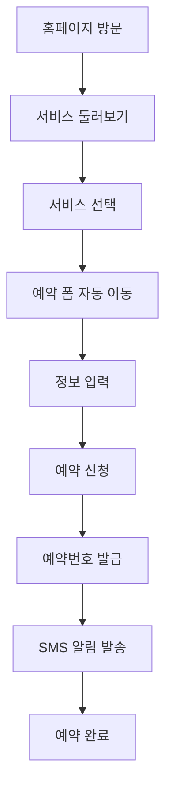
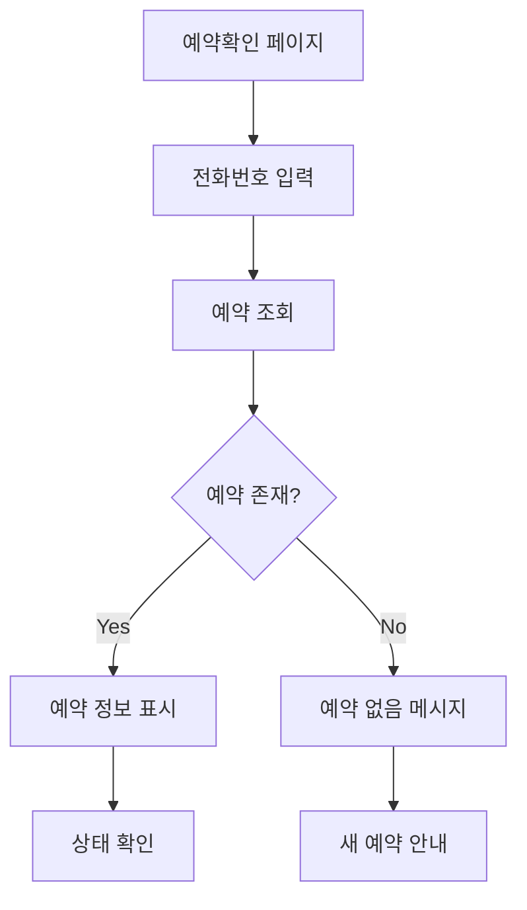
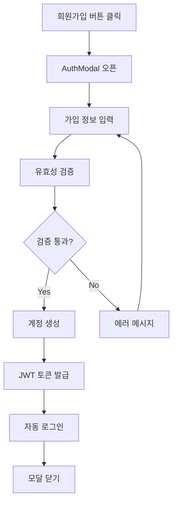
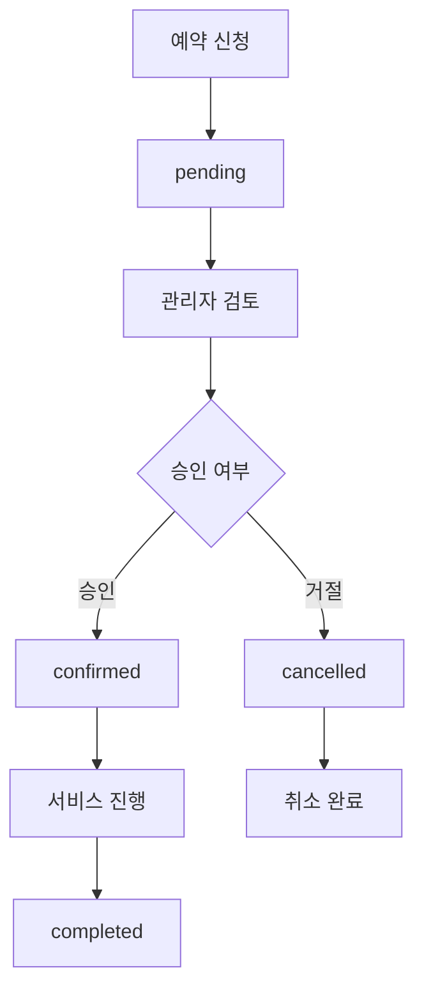

# Mission Clean 사용자 시스템 문서
**버전: v2.0 (20250628)**  
**작성일: 2025년 6월 28일**

## 📋 목차
1. [개요](#개요)
2. [일반 사용자 기능](#일반-사용자-기능)
3. [사용자 API 명세](#사용자-api-명세)
4. [사용자 인터페이스](#사용자-인터페이스)
5. [사용자 흐름](#사용자-흐름)
6. [기술 명세](#기술-명세)

---

## 🎯 개요

Mission Clean 사용자 시스템은 고객이 에어컨 청소 서비스를 예약하고 관리할 수 있는 웹 기반 플랫폼입니다.

### 주요 기능
- **🔖 서비스 예약**: 다양한 에어컨 타입별 청소 서비스 예약
- **📞 예약 확인**: 전화번호로 예약 상태 실시간 확인
- **👤 회원 관리**: 회원가입, 로그인, 프로필 관리
- **📱 반응형 디자인**: 모바일/태블릿/데스크톱 최적화
- **🔔 실시간 알림**: SMS 예약 확인 알림

### 대상 사용자
- **일반 고객**: 에어컨 청소 서비스를 이용하려는 개인/기업
- **회원 고객**: 가입을 통해 추가 혜택을 받는 고객
- **비회원 고객**: 간편하게 예약만 진행하는 고객

---

## 🚀 일반 사용자 기능

### 1. 🔖 예약 기능
**경로**: `/` (홈페이지 예약 섹션)

#### 예약 프로세스
1. **서비스 선택**
   - 벽걸이형, 스탠드형, 시스템1way, 시스템4way, 실외기, 2대이상
   - 각 서비스별 상세 설명 및 가격 정보
   - 서비스 선택 시 자동으로 예약 폼으로 이동

2. **예약 정보 입력**
   ```typescript
   interface BookingForm {
     name: string;           // 고객명 (필수)
     phone: string;          // 전화번호 (필수)
     address: string;        // 서비스 주소 (필수)
     serviceType: string;    // 서비스 타입 (자동 입력)
     preferredDate?: string; // 희망 날짜 (선택)
     preferredTime?: string; // 희망 시간 (선택)
     message?: string;       // 특별 요청사항 (선택)
   }
   ```

3. **예약 확인**
   - 예약번호 자동 생성
   - 접수 완료 알림
   - SMS 알림 발송 (기사님께)

#### 지원 서비스 타입
- **벽걸이형**: 일반 가정용 벽걸이 에어컨
- **스탠드형**: 대형 스탠드 에어컨
- **시스템1way**: 시스템 에어컨 (1way)
- **시스템4way**: 시스템 에어컨 (4way)
- **실외기**: 실외기 전용 청소
- **2대이상**: 다수 에어컨 청소

#### 예약 상태
- `pending`: 접수 대기중 (기본값)
- `confirmed`: 예약 확정
- `completed`: 서비스 완료
- `cancelled`: 예약 취소

### 2. 📞 예약 확인 기능
**경로**: `/booking-check`

#### 주요 기능
- **간편 조회**: 전화번호만으로 예약 확인
- **최신 예약 우선**: 같은 번호의 여러 예약 중 최신 예약 표시
- **상세 정보**: 예약번호, 상태, 서비스 정보, 일정 등

#### 조회 가능 정보
```typescript
interface BookingInfo {
  booking_id: number;        // 예약번호
  customer_name: string;     // 고객명
  customer_phone: string;    // 연락처
  customer_address: string;  // 서비스 주소
  service_type: string;      // 서비스 종류
  service_date: string;      // 희망 날짜
  service_time: string;      // 희망 시간
  special_requests: string;  // 요청사항
  status: string;           // 예약 상태
  created_at: string;       // 신청일
}
```

#### 상태별 표시
- **접수 대기중**: 🟡 노란색 (검토 중)
- **예약 확정**: 🔵 파란색 (일정 확정)
- **서비스 완료**: 🟢 초록색 (청소 완료)
- **취소됨**: 🔴 빨간색 (예약 취소)

### 3. 👤 회원 기능

#### 3.1 회원가입
**방식**: 모달 기반 (Header에서 접근)

**필수 정보**:
- 사용자명 (2자 이상)
- 이메일 (유효한 형식)
- 비밀번호 (6자 이상)
- 비밀번호 확인

**가입 혜택**:
- 예약 이력 관리
- 개인정보 자동 입력
- 할인 혜택 제공
- 우선 예약 서비스

#### 3.2 로그인
**방식**: 모달 기반 또는 `/admin` (관리자)

**일반 로그인**:
- 이메일 + 비밀번호
- JWT 토큰 발급 (7일 유효)
- 자동 로그인 유지

**관리자 로그인**:
- 별도 페이지 (`/admin`)
- 이메일 기억하기 기능
- 관리자 대시보드 자동 이동

#### 3.3 프로필 관리
- **기본 정보**: 사용자명, 이메일
- **권한 표시**: 고객/매니저/관리자
- **예약 이력**: 개인 예약 내역 (미래 기능)
- **로그아웃**: 토큰 제거 및 상태 초기화

---

## 🔌 사용자 API 명세

### 예약 관련 API

#### POST `/api/bookings`
예약 신청 (비회원/회원 모두 가능)

**Request Body:**
```json
{
  "name": "홍길동",
  "phone": "010-1234-5678",
  "address": "대전광역시 중구 테스트동 123번지",
  "serviceType": "벽걸이형",
  "preferredDate": "2025-07-10",
  "preferredTime": "afternoon",
  "message": "2층에 위치한 에어컨입니다."
}
```

**Response:**
```json
{
  "success": true,
  "message": "예약 신청이 완료되었습니다",
  "bookingId": 42,
  "data": {
    "name": "홍길동",
    "phone": "010-1234-5678",
    "serviceType": "벽걸이형"
  }
}
```

#### POST `/api/bookings/check`
예약 확인 (공개 API)

**Request Body:**
```json
{
  "phone": "010-1234-5678"
}
```

**Response:**
```json
{
  "success": true,
  "data": {
    "booking_id": 42,
    "customer_name": "홍길동",
    "customer_phone": "010-1234-5678",
    "customer_address": "대전광역시 중구 테스트동 123번지",
    "service_type": "벽걸이형",
    "service_date": "2025-07-10",
    "service_time": "afternoon",
    "special_requests": "2층에 위치한 에어컨입니다.",
    "status": "pending",
    "created_at": "2025-06-28T10:30:00Z"
  }
}
```

### 인증 관련 API

#### POST `/api/auth/register`
회원가입

**Request Body:**
```json
{
  "username": "신규고객",
  "email": "customer@example.com",
  "password": "password123"
}
```

**Response:**
```json
{
  "success": true,
  "message": "회원가입이 완료되었습니다.",
  "data": {
    "token": "eyJhbGciOiJIUzI1NiIs...",
    "user": {
      "id": 5,
      "username": "신규고객",
      "email": "customer@example.com",
      "role": "customer"
    }
  }
}
```

#### POST `/api/auth/login`
로그인

**Request Body:**
```json
{
  "email": "customer@example.com",
  "password": "password123"
}
```

**Response:**
```json
{
  "success": true,
  "message": "로그인이 완료되었습니다.",
  "data": {
    "token": "eyJhbGciOiJIUzI1NiIs...",
    "user": {
      "id": 5,
      "username": "신규고객",
      "email": "customer@example.com",
      "role": "customer"
    }
  }
}
```

#### GET `/api/auth/profile`
프로필 조회 (인증 필요)

**Headers:**
```
Authorization: Bearer {token}
```

**Response:**
```json
{
  "success": true,
  "data": {
    "user": {
      "id": 5,
      "username": "신규고객",
      "email": "customer@example.com",
      "role": "customer"
    }
  }
}
```

#### POST `/api/auth/logout`
로그아웃 (인증 필요)

---

## 🎨 사용자 인터페이스

### 페이지 구조

```
📱 Mission Clean
├── 🏠 HomePage (/)
│   ├── Hero Section
│   ├── 서비스 소개
│   ├── 서비스 선택 카드
│   └── 📞 예약 폼 (ContactSection)
├── 📋 BookingCheckPage (/booking-check)
│   ├── 전화번호 입력 폼
│   └── 예약 정보 표시
└── 🔐 AdminLoginPage (/admin)
    └── 관리자 로그인 폼
```

### 컴포넌트 구조

```
src/
├── components/
│   ├── Header.tsx              # 네비게이션 + 인증 UI
│   ├── Footer.tsx              # 푸터 정보
│   ├── ContactSection.tsx      # 예약 폼
│   ├── AuthModal.tsx           # 로그인/회원가입 모달
│   └── admin/                  # 관리자 컴포넌트들
├── pages/
│   ├── HomePage.tsx            # 메인 페이지
│   ├── BookingCheckPage.tsx    # 예약 확인 페이지
│   └── AdminLoginPage.tsx      # 관리자 로그인
├── contexts/
│   ├── AuthContext.tsx         # 인증 상태 관리
│   └── BookingContext.tsx      # 예약 상태 관리
└── services/
    └── api.ts                  # API 서비스 레이어
```

### UI/UX 특징

#### 1. 반응형 디자인
- **모바일 우선**: 스마트폰에서 최적 경험
- **태블릿 지원**: 중간 크기 화면 최적화
- **데스크톱 확장**: 큰 화면에서 정보 확장 표시

#### 2. 접근성
- **키보드 네비게이션**: Tab키로 모든 요소 접근
- **스크린 리더**: 적절한 ARIA 레이블
- **색상 대비**: WCAG 가이드라인 준수

#### 3. 사용자 경험
- **원클릭 예약**: 서비스 선택 후 자동 스크롤
- **실시간 피드백**: 로딩 상태 및 에러 메시지
- **직관적 아이콘**: 이모지로 기능 구분

---

## 🔄 사용자 흐름

### 1. 신규 고객 예약 플로우



### 2. 기존 고객 예약 확인 플로우



### 3. 회원 가입 플로우



### 4. 예약 상태 변화 플로우



---

## 🛠 기술 명세

### 프론트엔드 기술 스택

#### 핵심 라이브러리
- **React 18**: 함수형 컴포넌트 + Hooks
- **TypeScript**: 타입 안전성 보장
- **Vite**: 빠른 개발 서버 및 빌드
- **Tailwind CSS**: 유틸리티 기반 스타일링

#### 상태 관리
- **Context API**: 전역 상태 (Auth, Booking)
- **useState/useEffect**: 지역 상태 관리
- **useMemo/useCallback**: 성능 최적화

#### 폼 관리
- **네이티브 HTML5**: 기본 검증 활용
- **커스텀 훅**: 폼 상태 관리
- **실시간 검증**: 입력 중 에러 체크

### 백엔드 기술 스택

#### 서버 구성
- **Node.js + Express**: RESTful API 서버
- **Sequelize ORM**: 데이터베이스 추상화
- **PostgreSQL**: 운영 데이터베이스
- **SQLite**: 개발 데이터베이스

#### 인증 시스템
- **JWT**: 상태 비저장 토큰 인증
- **bcrypt**: 비밀번호 해싱 (12 rounds)
- **미들웨어**: authenticateToken, requireRole

#### 데이터 검증
- **입력 검증**: 서버 사이드 유효성 검사
- **XSS 방지**: 입력값 이스케이프
- **SQL 인젝션 방지**: ORM 사용

### 배포 및 운영

#### 컨테이너화
```dockerfile
# Dockerfile 예시
FROM node:18-alpine
WORKDIR /app
COPY package*.json ./
RUN npm ci --only=production
COPY . .
EXPOSE 3000
CMD ["npm", "start"]
```

#### Docker Compose
```yaml
services:
  client:
    build: ./client
    ports:
      - "3000:3000"
  
  server:
    build: ./server
    ports:
      - "3001:3001"
    environment:
      - NODE_ENV=production
  
  db:
    image: postgres:15
    environment:
      - POSTGRES_DB=mission_clean
```

#### 환경 변수
```env
# 프론트엔드
VITE_API_BASE_URL=https://api.missionclean.co.kr

# 백엔드
NODE_ENV=production
PORT=3001
JWT_SECRET=your-production-secret-key
DB_HOST=localhost
DB_NAME=mission_clean
DB_USER=postgres
DB_PASSWORD=secure-password
```

### 성능 최적화

#### 프론트엔드
- **코드 분할**: React.lazy로 지연 로딩
- **이미지 최적화**: WebP 포맷 사용
- **캐싱**: 브라우저 캐시 활용
- **번들 최적화**: Vite의 Tree shaking

#### 백엔드
- **데이터베이스 인덱싱**: 자주 조회되는 컬럼
- **API 응답 캐싱**: Redis 사용 고려
- **로그 관리**: winston 로거 사용
- **에러 처리**: 중앙집중식 에러 핸들링

### 보안 고려사항

#### 인증 보안
- **HTTPS 필수**: SSL 인증서 적용
- **CORS 설정**: 허용된 도메인만 접근
- **Rate Limiting**: API 호출 제한
- **토큰 만료**: 7일 자동 만료

#### 데이터 보안
- **개인정보 보호**: 전화번호 마스킹
- **SQL 인젝션 방지**: ORM 사용
- **XSS 방지**: 입력값 검증
- **로그 보안**: 민감 정보 제외

---

## 📱 모바일 최적화

### 터치 인터페이스
- **터치 타겟**: 최소 44px 크기
- **스와이프 제스처**: 자연스러운 스크롤
- **탭 피드백**: 시각적 반응

### 성능 최적화
- **이미지 압축**: 모바일 대역폭 고려
- **폰트 최적화**: 시스템 폰트 우선 사용
- **애니메이션**: GPU 가속 활용

### 모바일 UX
- **간편 입력**: 키보드 타입 최적화
- **원터치 전화**: tel: 링크 사용
- **위치 정보**: 주소 자동 완성

---

## 🔔 알림 시스템

### SMS 알림
- **예약 접수**: 고객에게 접수 확인
- **상태 변경**: 예약 상태 업데이트
- **서비스 완료**: 청소 완료 알림

### 이메일 알림 (향후 기능)
- **예약 확인서**: 상세 정보 포함
- **서비스 안내**: 준비사항 안내
- **만족도 조사**: 서비스 후 피드백

---

## 📊 Analytics & 모니터링

### 사용자 행동 분석
- **페이지 뷰**: 방문 페이지 추적
- **전환율**: 예약 완료율 측정
- **이탈률**: 페이지별 이탈 분석

### 성능 모니터링
- **응답 시간**: API 성능 측정
- **에러 추적**: 실시간 에러 모니터링
- **가용성**: 서비스 헬스 체크

---

## 🚀 미래 개선 계획

### 단기 개선 (1-3개월)
- **카카오톡 알림**: SMS 대신 카카오 알림
- **결제 시스템**: 온라인 결제 연동
- **리뷰 시스템**: 서비스 후 평가

### 중기 개선 (3-6개월)
- **AI 추천**: 개인화된 서비스 추천
- **실시간 채팅**: 고객 상담 기능
- **모바일 앱**: 네이티브 앱 개발

### 장기 개선 (6개월+)
- **IoT 연동**: 스마트 에어컨 연결
- **예측 분석**: 청소 주기 예측
- **확장성**: 다른 서비스 영역 확대

---

**최종 업데이트**: 2025년 6월 28일  
**다음 업데이트 예정**: 2025년 7월 말

---

*© 2025 Mission Clean. All rights reserved.* 